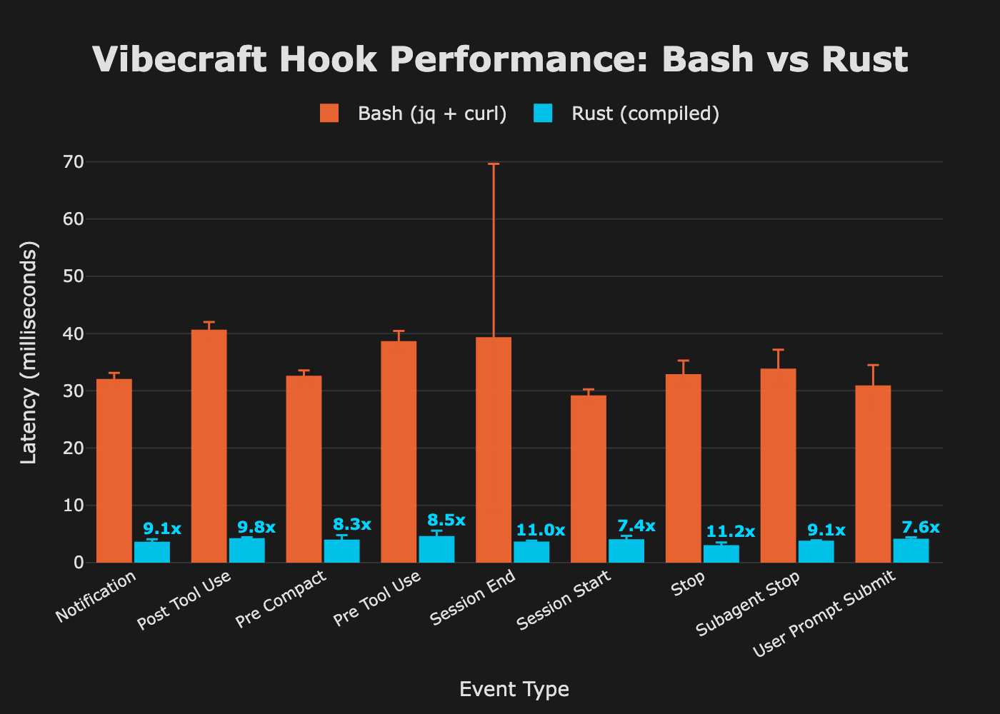

# Vibecraft Hook Performance Benchmarks

## Summary

The Rust hook provides **7-11x faster** event processing compared to the bash script.



| Metric | Bash | Rust | Improvement |
|--------|------|------|-------------|
| Mean latency | ~29-41ms | ~2.9-4.5ms | **~8-11x faster** |
| User CPU time | ~15-16ms | ~2ms | **~8x less** |
| System time | ~17-18ms | ~2ms | **~9x less** |
| Binary size | N/A (uses jq) | 1.8MB | Standalone |

## Detailed Results

### All Event Types

| Event Type | Bash (ms) | Rust (ms) | Speedup |
|------------|-----------|-----------|---------|
| Stop | 32.8 ± 2.5 | 2.9 ± 0.6 | **11.2x** |
| Session End | 39.3 ± 30.4 | 3.6 ± 0.3 | **11.0x** |
| Post Tool Use | 40.6 ± 1.5 | 4.1 ± 0.3 | **9.8x** |
| Notification | 31.9 ± 1.2 | 3.5 ± 0.6 | **9.1x** |
| Subagent Stop | 33.7 ± 3.4 | 3.7 ± 0.2 | **9.1x** |
| Pre Tool Use | 38.6 ± 1.9 | 4.5 ± 1.1 | **8.5x** |
| Pre Compact | 32.5 ± 1.1 | 3.9 ± 0.9 | **8.3x** |
| User Prompt Submit | 30.8 ± 3.7 | 4.0 ± 0.4 | **7.6x** |
| Session Start | 29.1 ± 1.2 | 4.0 ± 0.7 | **7.4x** |

### Individual Event Breakdowns

#### Pre-Tool Use Event
```
Bash:   38.6 ms ±  1.9 ms
Rust:    4.5 ms ±  1.1 ms
Speedup: 8.5x
```

#### Post-Tool Use Event
```
Bash:   40.6 ms ±  1.5 ms
Rust:    4.1 ms ±  0.3 ms
Speedup: 9.8x
```

#### Stop Event
```
Bash:   32.8 ms ±  2.5 ms
Rust:    2.9 ms ±  0.6 ms
Speedup: 11.2x
```

#### Session Start Event
```
Bash:   29.1 ms ±  1.2 ms
Rust:    4.0 ms ±  0.7 ms
Speedup: 7.4x
```

#### Notification Event
```
Bash:   31.9 ms ±  1.2 ms
Rust:    3.5 ms ±  0.6 ms
Speedup: 9.1x
```

#### User Prompt Submit Event
```
Bash:   30.8 ms ±  3.7 ms
Rust:    4.0 ms ±  0.4 ms
Speedup: 7.6x
```

## Why Rust is Faster

The bash hook's overhead comes from:

1. **Multiple jq invocations** (~15 per event) - Each `jq` call spawns a new process
2. **Shell process spawning** - Bash forks for subshells, pipes
3. **Tool discovery** - Finding `jq`, `curl` in PATH each time
4. **Timestamp generation** - Uses Perl/Python for millisecond precision on macOS

The Rust hook:

1. **Single binary** - No process spawning for JSON parsing
2. **serde_json** - Zero-allocation JSON parsing in-process
3. **Compiled** - No interpreter startup time
4. **Static linking** - No dynamic library loading (except system libs)

## Benchmark Methodology

### Tool

Benchmarks run using [hyperfine](https://github.com/sharkdp/hyperfine), a command-line benchmarking tool that:
- Runs multiple warmup iterations to prime caches
- Executes 30 timed runs per command
- Calculates mean, median, stddev, min, max
- Tracks memory usage

### Test Setup

```bash
hyperfine \
  --warmup 5 \
  --runs 30 \
  --export-json results/event_type.json \
  "cat payload.json | ./vibecraft-hook.sh" \
  "cat payload.json | ./rust/target/release/vibecraft-hook"
```

### Environment

- **Platform**: macOS (Apple Silicon M1/M2)
- **Rust**: 1.75+ (release build with LTO)
- **Bash**: 5.x with jq 1.7
- **HTTP notifications**: Disabled to isolate processing time

### Test Payloads

Synthetic payloads in `benchmark/payloads/` representing realistic Claude Code events:
- `pre_tool_use.json` - Read tool invocation
- `post_tool_use.json` - Edit tool completion
- `stop.json` - Claude stops responding
- `session_start.json` - New session
- `session_end.json` - Session ends
- `notification.json` - Permission prompt
- `user_prompt_submit.json` - User sends prompt
- `subagent_stop.json` - Subagent completes
- `pre_compact.json` - Context compaction

## Running Benchmarks

### Prerequisites

```bash
# Install hyperfine
brew install hyperfine

# Build Rust hook (release mode)
cd hooks/rust
cargo build --release
```

### Run All Benchmarks

```bash
cd hooks
./benchmark/run-benchmarks.sh
```

### Generate Visualization

```bash
cd hooks/benchmark
python visualize.py
# Outputs: performance-chart.html, performance-chart.png
```

Requires Python 3.x with `plotly` and `kaleido`:
```bash
pip install plotly kaleido
```

## Building from Source

### Development

```bash
cd hooks/rust
cargo build
```

### Release (optimized)

```bash
cd hooks/rust
cargo build --release
```

### Cross-Compilation

```bash
cd hooks/rust
./build-all.sh
```

Produces binaries for:
- macOS ARM64 (Apple Silicon)
- macOS x86_64 (Intel)
- macOS Universal (Fat binary)
- Linux x86_64 (requires musl cross-compiler)

## Raw Benchmark Data

Raw hyperfine JSON output is stored in `benchmark/results/`:

```
benchmark/results/
├── notification.json
├── post_tool_use.json
├── pre_compact.json
├── pre_tool_use.json
├── session_end.json
├── session_start.json
├── stop.json
├── subagent_stop.json
└── user_prompt_submit.json
```

Each file contains detailed timing data, memory usage, and exit codes for both bash and Rust implementations.
